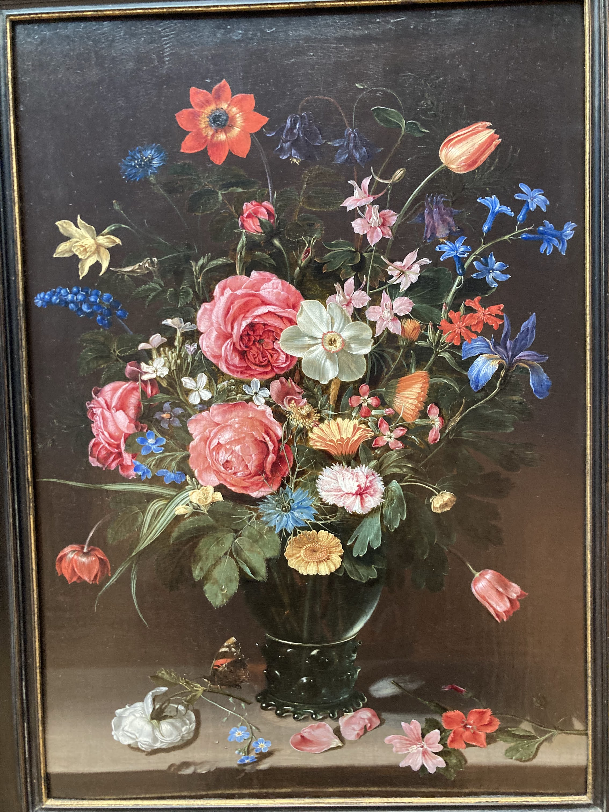
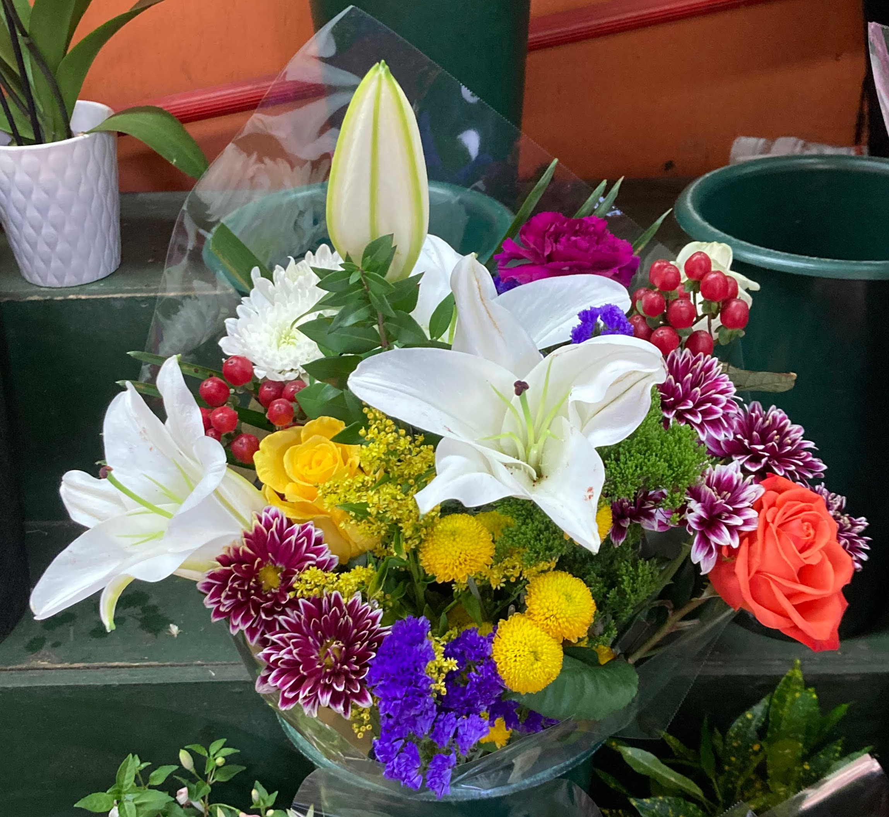
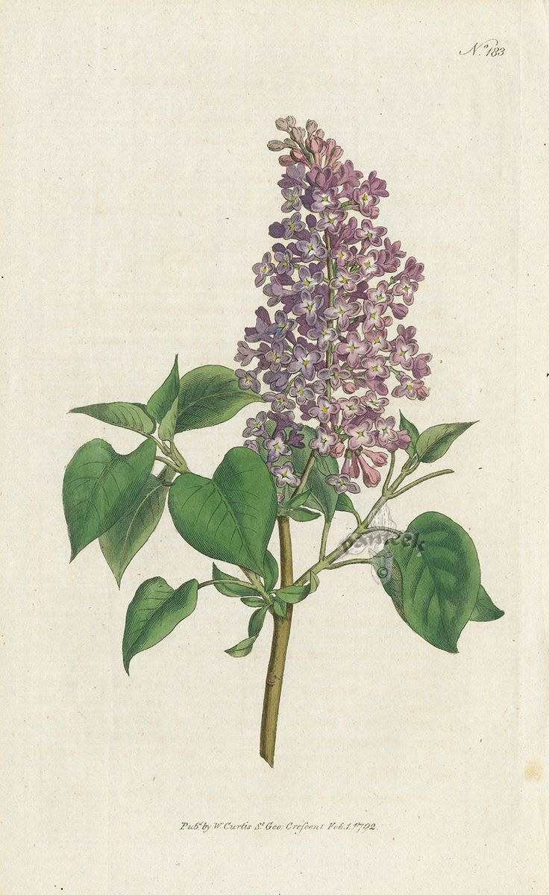

+++
title = "What is art?"
date = "2024-04-22"
description = "What is art?"
+++

What is art? While a simple question, it is a controversial topic in modern philosophy. This essay explores difficulties in defining art, and presents case studies involving plants to highlight the difficulties. I will raise more questions than I answer.

## Difficulties in defining art
Adajian describes ten constraints on definitions of art (Adajian). We focus on three of them.
1. Traditionally, artworks are intentionally endowed by their makers with properties, often sensory, having a significant degree of aesthetic interest, usually surpassing that of most everyday objects.
2. The arts are always changing, just as the rest of culture is: as artists experiment creatively, new genres, art-forms, and styles develop; standards of taste and sensibilities evolve; understandings of aesthetic properties, aesthetic experience, and the nature of art evolve.
3. Lots of things besides artworks – for example, natural entities (sunsets, landscapes, flowers, shadows), human beings, and abstract entities (theories, proofs, mathematical entities) – have interesting aesthetic properties.

We will consider these difficulties in defining art to highlight gray areas of what we consider art.
<!-- Contemporary definitions fall into two main categories, each dealing with the issues described above differently. The first category is conventionalist definitions, which take art’s contingent cultural features to be explanatorily fundamental. Note that conventionalist definitions may struggle with constraints 1 and 3. The second category is functional definitions, which directly consider the aesthetics of an artwork. Note that functional definitions may struggle with constraint 2. -->

## Case studies

Edouard Manet, Le Déjeuner sur l'herbe, 1862-63. Oil on canvas. Paris, Musée d’Orsay.

Consider the presented difficulties.
1. The painting of the bouquet is undoubtably significantly more aesthetic than every day objects. 
2. Still lives are an entire type of artwork, especially popular during the 17th century in modern day Netherlands. There is a long tradition of still lives and they are still found in modern works (such as the 2014 Kerry James Marshall painting we saw at The Metropolitan Museum of Art)
3. Not applicable.

This still life easily addresses all three difficulties, and we even analyzed this still life in class. It is hard to argue this isn't art, I even saw it at The Metropolitan Museum of Art.

Edouard Manet, Le Déjeuner sur l'herbe, 1862-63. Oil on canvas. Paris, Musée d’Orsay.

Consider the presented difficulties.
1. The bouquet is undoubtably significantly more aesthetic than every day objects, at least while the flowers are healthy.
2. Bouquets, and arranging flowers more generally, have a long tradition in romantic contexts, spiritual contexts, and more.
3. While bouquets contain natural flowers, they are arranged in specific ways by humans, so one can argue the fall under typical artwork.

This bouquet addresses difficulties 1 and 2, but difficulty 3 is slightly more unclear. Would a bouquet commonly be considered artwork? Is it adequately aesthetic and does it require enough human effort to make it art?

Edouard Manet, Le Déjeuner sur l'herbe, 1862-63. Oil on canvas. Paris, Musée d’Orsay.

https://www.pinterest.com/pin/beautiful-syringa-vulgaris-common-lilac--107171666113873206/

Consider the presented difficulties.
1. While the botanical drawing is aesthetic, the artist presumably did not intentionally make it aesthetic, rather the plant of interest is by itself aesthetic. 
2. There is a rich history of botanical drawings. However, these seem to be considered as science not art.
3. If drawings are automatically considered artwork, then this difficulty is not applicable. Otherwise, the consideration is similar to difficulty 1.

None of the difficulties are easily resolved. The key issue is that while the drawing is aesthetic, it is not drawn to be aesthetic.

Edouard Manet, Le Déjeuner sur l'herbe, 1862-63. Oil on canvas. Paris, Musée d’Orsay.

Consider the presented difficulties. 
1. I photographed this lilac tree in the New York Botanical Garden. Here, it clearly had a maker who placed somewhere to look aesthetic. Simply considering a lilac flower in a vaccum, the flower is aesthetic, yet it lacks a human maker.
2. Lilac flowers are long considered aesthetic and found in many gardens, however they are typically not by themselves considered art or found in art museums.
3. The lilac flower perfectly exemplifies this difficulty.

Again, none of the difficulties are easily resolved. Considering the tree in a botanical garden constructed by humans, it seems easier to resolve these difficulties. But perhaps its intrinsic aesthetic is sufficient for it to be part.

## References
- Adajian, Thomas. “The Definition of Art.” The Stanford Encyclopedia of Philosophy, edited by Edward N. Zalta, Spring 2022, Metaphysics Research Lab, Stanford University, 2022. Stanford Encyclopedia of Philosophy, https://plato.stanford.edu/archives/spr2022/entries/art-definition/.
