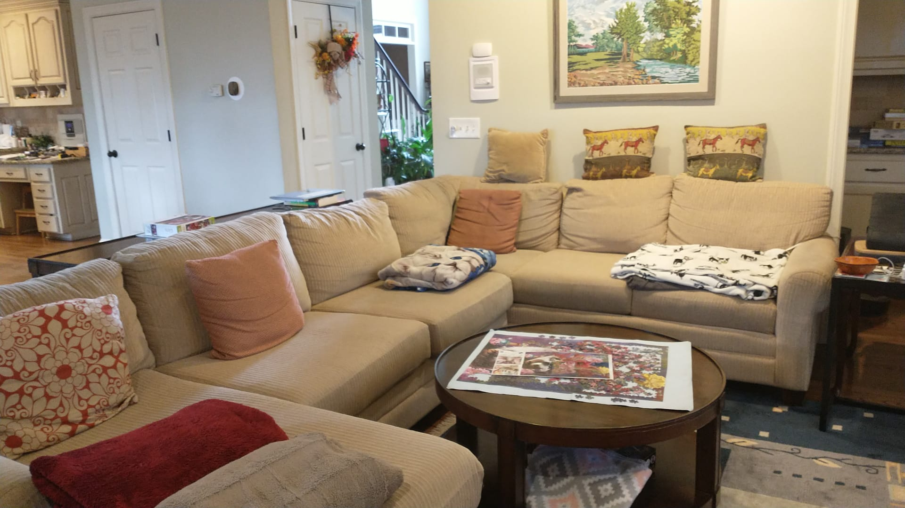

+++
title = "Art Autobiography"
date = "2024-01-28"
description = "Art in my house."
+++
<!-- Prepare the equivalent of a one- to two-page entry and write about your prior
experience/familiarity with the visual arts. You might write about a specific work of art
that you have encountered – which could be anything from a work of art in a museum, to
a poster in your family home, or a public sculpture or work of art in your
hometown/neighborhood, or a meaningful visit to a museum, gallery, building that
impacted you. Record your observations about the work, your experience, your
emotions.  -->
My grandmother is the only person in my family who regularly creates artwork that fit in a frame. She has most commonly created landscapes of temperate forests with large mountains in the distance, occasionally featuring small, old European structures. While she has explored mediums like oil painting, she mainly does cross-stitching. She has stitched with and without books for reference.

Grandmother, Untitled, 2016. Cross-stitch. Atlanta.

Grandmother, Untitled, 2016. Cross-stitch. Atlanta.

One of her pieces is situated in the living room right above the couch. I do not know of a name and I estimate it was finished around five to ten years ago. Due to its size and the difficulty of cross-stitching, it must have taken anywhere from a few weeks to a few months of continuous dedication in the evenings. 

## Landscape
The atmospheric landscape cross-stitch can be split up into four sections separated by color, distance in the scene, and location on the ground. 
1. The first section is at the very bottom of the cross-stitch, where there is a small river on the right, and a dirt bank on the left with large brown grasses in front of it. The river and dirt both have a substantial presence in the cross-stitch and their colors have more contrast than those of the further sections. The river goes up the frame and disappears into the trees and bushes in the middle and on the right. The dirt similarly disappears into green grasses dotted with shadows of large trees. 
2. The grasses, bushes, and the main trees denote section two. Colors are still vibrant and there is significant contrast with the dark shadows in the light green grass. The trees and bushes take up much of the right side of the frame and have a very warm color tone. I am not sure what kind of trees these could be, my guess is oak or beech because of the deciduous look and since many of my grandmother's artworks seem European.
3. The third section is even further up the frame and features aqua colored, washed out trees and bushes. The colors are much cooler and more washed out, creating the effect of a haze and giving a more mysterious feel to the vegetation. 
4. The distant mountain and lake near the top left corner of the cross-stitch are much further away from the scene. Strangely, the mountains are purple and black. The colors become even cooler, almost extremely so.
The crowdedness of the right side of the cross-stitch, contrasted by the open grasses and generous opening in the distant trees, naturally invites one to look at the vibrant lake and mountains in the distance on the left. Strangely, there is lots of emphasis and vibrancy in color in the very distance and right in the front of the cross-stitch. However, the middle of the cross-stitch is rather plain in comparison.

## Sky
The sky has lots of depth and different elements, there are many clouds and very little plain blue sky. It can be split up into three sections, separated by distance.
1. The first section consists of cumulus clouds which are closest to the ground. As these are the closest, similar to the ground, they have the most contrast and are less washed out.
2. There are also higher stratus or altostratus clouds above the cumulus clouds. These fill some of the sky that would otherwise just be blue and all have the same exact color. However, they have very irregular shapes at the boundaries and almost invite one to find recognizable faces and figures.
3. Finally there is the blue sky. It is a very soft and light baby blue that gives an almost detached feeling.

## Entire cross-stitch
The cross-stitch is not "easy" to look at, as it has many contrasting elements and irregular shapes. The dirt river bank and river in the front of the cross-stitch almost make the viewer want to jump in and play. The faded out colors in the middle of the cross-stitch and the sky give a sense of the indifference of nature. Finally, the vibrance of the mountains in the distance leave the viewer awestruck by the power of nature. All together, it makes for a humbling piece of art hung up where my family spends much of its time.

## References
- The Frick Collection. Writing About Art for Beginners. 2023. YouTube, https://www.youtube.com/watch?v=ao1ryqwmd_Q.

<!-- # Notes
Watched the first 26 minutes of: 
https://www.youtube.com/watch?v=ao1ryqwmd_Q

Think about explicit and implicit aspects of the artwork.
Ekphrasis:
- goal is to recreate the sense of observing the work.

Visual description:
- Literally and directly relaying what the artwork shows

Formal analysis:
- uses both visual description and interpretive claims
- Artist, title, date, and medium starting point.
- Representative (can still have idealizations and exaggerations) vs abstract art
- Objective art has specific subject matter whereas non-objective doesnt.

naturalism - abstraction
idealization - realism

Relation to the title is good.

Consider elements
- Line, color, shape, texture, size and scale, composition, perspective (vanishing point vs atmospheric), lighting/value, space (negative space usage?), mass

Principles
- emphasis, balance, proportion, contrast, rhythm, movement, pattern, repetition, unity

Close looking before writing

Cross stitch in my living room

Formal analysis tips: show don't tell

Stylistic Analysis:
- Subject matter
- Deliniation of forms -->

