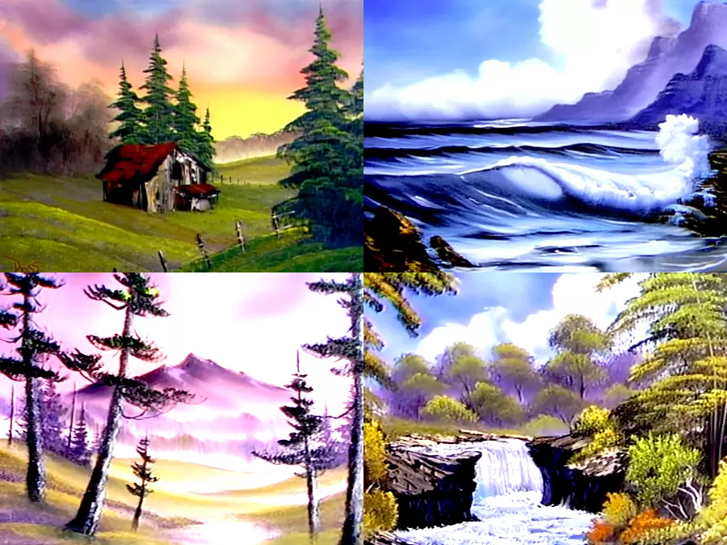

+++
title = "Bob Ross in Art History"
date = "2024-04-22"
description = "Bob Ross in Art History."
+++

The syllabus of Masterpieces of Western Art at Columbia ignores one of the most famous modern painters, Bob Ross. In this essay, I attempt to insert him into the canon. 

## Bob Ross
Bob Ross was born in 1942 in Daytona Beach, Florida. He started painting while stationed in Alaska with the US Air Force. He later learned his alla prima, colloquially known as wet-on-wet, oil painting technique from Bill Alexander, host of _The Magic of Oil Painting_. Bill's aired on PBS from 1974 to 1982. Bob Ross took his place on PBS for his show _The Joy of Painting_ from 1983 to 1995. In each episode, Bob invited viewers to paint along as he created a scenic landscape from start to finish in 30 minutes. 

## Artistic Style
While his paintings appear to have some impressionistic elements, he mainly painted indoors. He would let his imagination roam free and enjoy the painting process, saying "We don't make mistakes, we just have happy accidents", "We don't know where [the trees] will go, where ever you want them, that's exactly where they should live", and "If painting does nothing else for you, it should make you happy". He regularly used ariel perspective to create depth.

Bob Ross, Cabin at Sunset (top left), Secluded Beach (top right), Misty Rolling Hills (bottom left), Misty Waterfall (bottom right), 1985-1986. Oil Painting, Private Collection.

His paintings consist mostly of landscape paintings, with the exception of several seascapes. He often painted mountains, lakes, and huts. He barely innovated his style and explained mechanically exactly what he was doing. 

## Island in the Wilderness


I will focus on his painting in episode 1 of season 29, titled _Island in the Wilderness_. 

This painting is very layered, making it pleasing and easy to comprehend. In the very foreground are large trees, shrubs, and a path, almost inviting the viewer to enter the painting. There is an island with similar trees and shrubs, just smaller to create distance. Further back is a line of dark pine trees, right under the misty sunset. The blue and pink of the sunset are very beautiful and pleasing to the eye. While simplistic, it is undoubtably beautiful and calming.

## References
- Bob Ross | Biography, Art, Death, & Facts | Britannica. 7 Mar. 2024, https://www.britannica.com/biography/Bob-Ross.

<!-- https://www.britannica.com/biography/Bob-Ross

Focus on https://www.youtube.com/watch?v=lLWEXRAnQd0 and do a formal analysis  -->

<!-- On the surface, yes, The Joy of Painting is designed so folks can dabble along from home. But it's a rare fan who's squeezed out a tube of Prussian Blue. Ross knew it. As he told the Orlando Sentinel in 1990: "The majority of our audience does not paint, has no desire to paint, will never paint." Instead, the show's appeal is more abstract. It's less about the art lesson, and more about the mood: cozy, nurturing — an audio-visual pat on the back, coaxing the audience to try something new. For 22 minutes, at least, there's no fear of failure. As Ross used to say, "We don't make mistakes, we just have happy accidents."
https://www.cbc.ca/arts/it-s-the-world-s-biggest-museum-exhibition-of-bob-ross-paintings-so-how-d-it-wind-up-in-b-c-1.5659949

The town of 10,000 is known for its local distillery and is a short drive from the headquarters of Bob Ross Inc., which still coordinates community art programmes. It was in this area that Ross was ‘discovered’ some 40 years ago, then a student of Bill Alexander, to whom he attributes the ‘wet-on-wet’ method of rapidly applying layers of oil pigment to a gessoed canvas during a brief window of time. There’s something impressionistic about this approach, working as it does to approximate rustic scenes in a picturesque mode. But where the impressionists relied on external perception, Ross’s signature move was to work indoors, tapping into the mind’s eye, encouraging the viewer at home to paint along and improvise. As one quote on the wall text at Franklin Park reminds viewers, ‘Painting is an individual thing. Each of us sees nature through different eyes.’
https://www.frieze.com/article/what-art-world-can-learn-bob-ross -->

