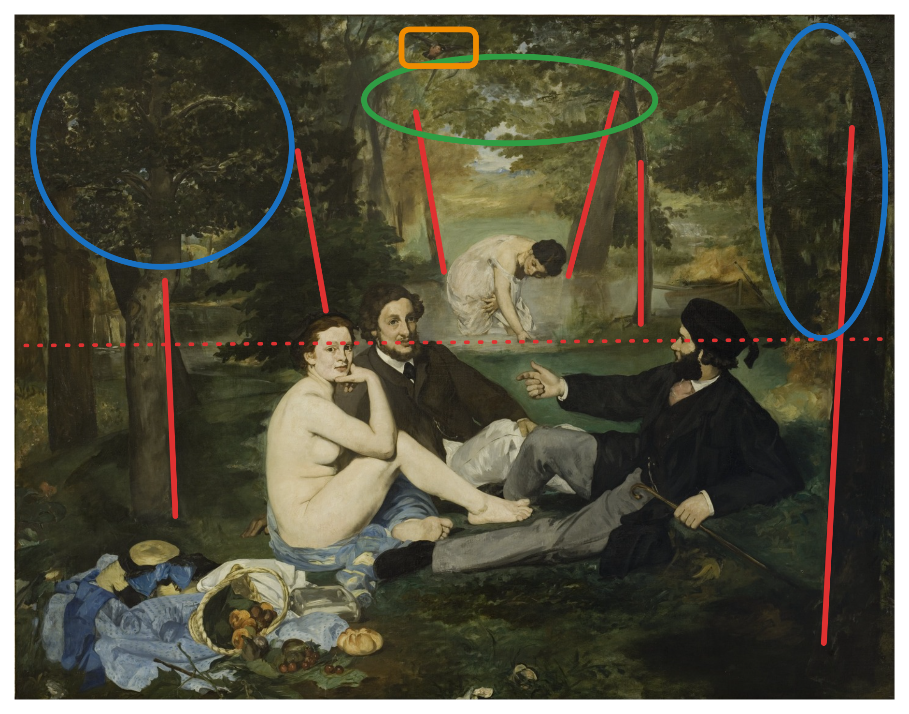

+++
title = "Plants in Manet's Le Déjeuner sur l'herbe"
date = "2024-04-22"
description = "Plants in Manet's Le Déjeuner sur l'herbe."
+++

Edouard Manet, Le Déjeuner sur l'herbe, 1862-63. Oil on canvas. Paris, Musée d’Orsay.

In class, we analyzed Manet's Le Déjeuner sur l'herbe. We mainly focused on the figures, paying little attention to the plants. This essay focuses on the plants, mainly how they emphasize the juxtaposition of the woman in the front and the woman in the back of the painting.

Edouard Manet, Le Déjeuner sur l'herbe, 1862-63. Oil on canvas. Paris, Musée d’Orsay.

The painting can be divided into two sections where the water meets the grass (dashed red line in the annotated painting). 

## Back
Consider the back section. In the very back, the forest transitions to an open grassy field with lots of light, the only entrance into the scene. The last pair of trees before the field are angled outwards, as if it welcome visitors from the field (red lines in the back). There is another notable pair of trees right by the water, also slightly angled outwards (red lines in the middle). Both of these trees are young and small compared to the rest of the forest. The color of the leaves in the canopy in the back of the image is very bright (green oval). 

The plants sets the stage for the woman in the back. She is dressed in a thin white dress and modestly looks down as she bathes. The young trees and bright leaves enhance the youth and innocence of the bather. The opening in the trees alludes to ancient public bath houses. This makes the woman appear innocent and acceptable, instead of a symbol of sex and desire.

## Front
Now consider the front of the image. The main trees in the front are old, tall, and straight (red lines in the front). This blocks off visitors from the sides, with the only opening being the gap in the back. The leaves are much darker (blue oval). Additionally, there is a small still life of cherries and bread in the very front. However, it is knocked over and leaves serve to keep the cherries off the ground.

The plants in the front set a different the stage for the woman. She is completely naked and shamelessly looks directly at us. With the dark trees blocking any visitors from the sides and one of the men blocking her from the gap in the trees in the back, she is exposed only to us and the men. Additionally, the still life contains cherries symbols of sexuality and joy. It is also knocked over and chaotic. This makes the woman appear as scandalous and unacceptable symbol of sex and desire, opposite to the woman in the back. 

## Other details
The brush strokes of the plants are much rougher than the figures. This directs our attention towards the figures. Additionally, there is a small bird at the top of the image (orange rectangle). Perhaps this bird is like us, a voyeur.

<!-- Finer brush strokes used for the people and the still life.

Plants create depth in the scene

Plants provide cover

Pose of the man on the left similar to Adam in The Creation of Adam my Michaelangelo. 

Branches and trunks open up in the back and invite the outside world to look at the bather in the back. She is also clothed in all white, appears very innocent, away from the men, and is next to younger trees.

Scene in the front is surrounded by larger trees, providing more cover. 

Thick brushstrokes in the leaves and trees pushes attention away from them and towards the central figures.

Little bird in the top center of the image.

Privacy in the front almost creates a more mischevious attmosphere, as if she were a stripper, strippers wouldn't do that in public, but the woman in the back is more public

only leaves with any detail are the ones in the still life, act similar to a plate

Trees act similar to walls, open door and plate -->