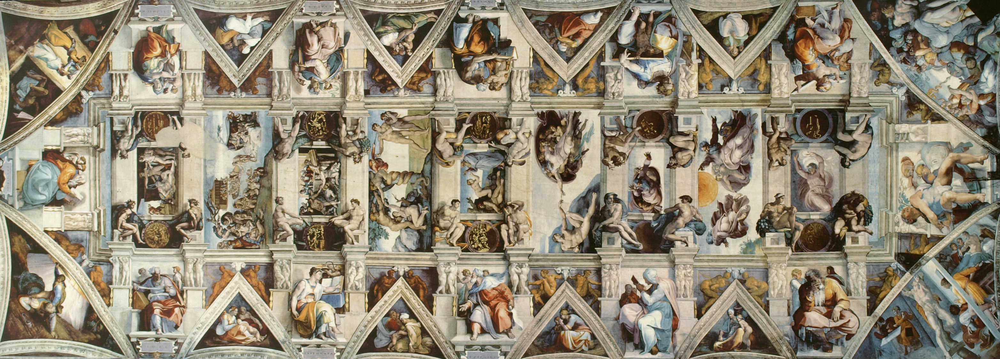

+++
title = "Materials Michaelangelo Used in the Sistine Chapel Frescos"
date = "2024-02-27"
description = "Understanding the blue Michaelangelo used in the Sistine Chapel frescos."
+++

Pope Julius II commissioned Michaelangelo to paint the ceiling of the Sistine Chapel in 1508. Reluctantly, Michaelangelo accepted and spent four years creating elaborate frescos on the ceiling with little help (Sistine Chapel). Creating frescos is an elaborate process. Michaelangelo first applied a plaster consisting of lime, water, and a volcanic ash onto a surface he prepared the day before (Fresco Painting). It is believed that he occasionally even put another layer of preparation to brighten the colors. Then, he imprinted his prepared cartoon onto the plaster as a guide for painting. He allegedly used only seven mineral based colors, including green earth pigment for green, ochre for yellows and reds, and cobalt for blue (orion7747). This essay focuses on his use of blue.

Michelangelo, Sistine Chapel Ceiling, 1508-1512. Fresco, Vatican, Sistine Chapel

Blue is a rare color in nature, outside of the sky and water. This is because blue is created when objects absorb low wavelength light such as red light. For the most part, this requires larger and more complex molecules that rarely appear in plants and in stones (Weisberger). In painting during the renaissance, blue was also hard to come by and much more expensive than other colors. Michaelangelo obtained azurite from Florence and used it to paint the ceiling of the Sistine Chapel (Wallace). However, azurite was not the most sought after pigment for blue. Ultramarine was considered far superior due to its "tonally rich color, in contrast to the relatively flat and grainy azurite" (Cennini).

However, while azurite was readily found throughout Europe, ultramarine was created from lapis lazuli, which was sourced from the mountains in modern day northern Afghanistan. During the renaissance, it was worth more than gold. To this day, miners in Afghanistan leave their families to travel to high altitudes and dig deep into the tops of mountains in hopes of finding the precious stone (Al Jazeera English). 



Due to it's cost, ultramarine was typically used to add final details to a dry fresco (Fresco Painting). But that would have required Michaelangelo to reconstruct the scaffolding and paint for another few months. Allegedly, when Pope Julius II saw the completed ceiling for the first time in 1512, he said to Michaelangelo "It must still be necessary to have it retouched with gold", to which Michaelangelo replied "I do not see that such men should wear gold," referring to the men he painted. Then the Pope said "It will look poor." Finally, Michaelangelo said "Those who are depicted there, they were poor too". That settled it (Cast).

In 1534, Pope Paul III commissioned Michaelangelo to paint the west wall of the Sistine Chapel (Sistine Chapel). This time, the Pope paid for Michaelangelo to use ultramarine throughout the entire fresco painting process (The Last Judgement).

Michelangelo, Sistine Chapel West Wall, 1534-1541. Fresco, Vatican, Sistine Chapel

The difference is striking. The blues in the ceiling are significantly more duller than the west wall. Particularly, the background of the west wall and the clothes of several figures are incredibly vibrant, whereas similar features are washed out in the ceiling. Perhaps Michaelangelo purposely avoided using as much blue in the ceiling.

Michelangelo, Sistine Chapel Ceiling and West Wall, 1508-1512 and 1534-1541. Fresco, Vatican, Sistine Chapel

## References
- Al Jazeera English. Lapis Lazuli Mining in Sari-i-Sang in Northern Afghanistan. 2007. YouTube, https://www.youtube.com/watch?v=pwyc5uRxvYE.
- Cast, David. “Finishing the Sistine.” The Art Bulletin, vol. 73, no. 4, Dec. 1991, p. 669. DOI.org (Crossref), https://doi.org/10.2307/3045836.
- Cennini, Cennino, et al. The Craftsman’s Handbook: The Italian “Il Libro Dell’arte.” Dover Publ, 1960.
- Fresco Painting | History, Method, & Examples | Britannica. https://www.britannica.com/art/fresco-painting. Accessed 24 Apr. 2024.
- orion7747. Michelangelo’s Fresco Painting Technique Demonstration from a NOVA Episode. 2009. YouTube, https://www.youtube.com/watch?v=Cej4Ggq5nQI.
- Sistine Chapel | History, Paintings, & Facts | Britannica. 9 Apr. 2024, https://www.britannica.com/topic/Sistine-Chapel.
- The Last Judgement - The Last Judgement. https://www.thelastjudgement.org/. Accessed 24 Apr. 2024.
- Wallace, William E. and Michelangelo Buonarroti. Michelangelo: The Artist, the Man, and His Times. Cambridge University Press, 2010.
- Weisberger, Mindy. “Why Is the Color Blue so Rare in Nature?” Livescience.Com, 6 Sept. 2021, https://www.livescience.com/why-blue-rare-in-nature.html.

<!-- *(Cennini 1960, 36)

Typically, I will specifically focus on his use of blue. 

ceiling was 

Green earth for greens, Ochre for yellows and reds, cobalt or lapiz lazuli for blue

vermilion, a vibrant red pigment derived from mercury sulfide, lead white, which provided a brilliant white hue

plaster, composed of lime, sand, and water

Among the colours Michelangelo began purchasing in the spring of 1536 was one which was only found in Afghanistan, ultramarine, a precious blue made of crushed lapis lazuli, the most expensive of all the Renaissance colours, more expensive than gold, usually reserved for the Virgin's cloak, or flashes of heavenly sky in paintings by Titian.

As the restoration of The Last Judgment reveals, Michelangelo was probably the only painter ever to use ultramarine with true promiscuity and abandon; the Pope was paying. What we now see at the east wall of the Sistine chapel is an artist taking a precious material and splashing it about as if it were house paint.

https://blog.johncabot.edu/study-abroad/the-fresco-mastering-michelangelos-technique-when-you-study-abroad-in-italy#:~:text=The%20amazing%20durability%20of%20fresco,colors%20appear%20translucent%2C%20like%20watercolor.

Michelangelo used only seven distinct pigments for the entire composition. Each pigment was derived from minerals found in earth and clay - ochre for reds, lapis lazuli for blues, and so forth

https://commons.wikimedia.org/wiki/Category:Sistine_Chapel_ceiling#/media/File:Sistine_Chapel_ceiling_02.jpg

https://www.britannica.com/art/fresco-painting

https://www.britannica.com/topic/Sistine-Chapel -->

