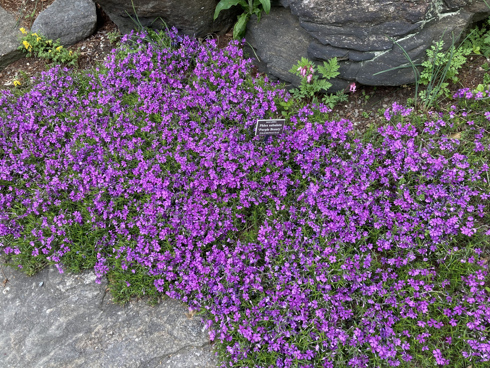

+++
title = "New York Botanical Garden, Rock Garden"
date = "2024-04-22"
description = "Rock garden formal analysis."
+++

This essay applies artistic formal analysis to gardens, specifically to the Rock Garden in the New York Botanical Garden.

## Analyzing gardens

Analyzing gardens presents unique opportunities and difficulties compared to paintings and sculpture. The garden can be viewed from every possible angle, especially from inside. Famous garden designer Piet Oudolf says "I can see things that will happen over time." Lighting changes throughout the day, leaves change throughout the seasons, and plants grown and die throughout the years. 

More so than painting and other mediums, there are many natural limitations of whether the plants can tollerate the weather, how much light plants get, what wildlife the plants attract, and more (Roach).

## Rock Garden

Consider the Rock Garden at the New York Botanical Garden in the Bronx.

Edouard Manet, Le Déjeuner sur l'herbe, 1862-63. Oil on canvas. Paris, Musée d’Orsay.

The oval path through the garden gives the general layout. To the outside of the paths, shrubs and trees gradually get larger to create the border of the garden. 

Edouard Manet, Le Déjeuner sur l'herbe, 1862-63. Oil on canvas. Paris, Musée d’Orsay.

Edouard Manet, Le Déjeuner sur l'herbe, 1862-63. Oil on canvas. Paris, Musée d’Orsay.

Inside the oval path (the middle section), there are larger shrubs at the top, some of which are evergreens. They provide protection from the sun and privacy from viewers at the bottom throughout the seasons. In the middle, there are lots of small plants, flowers, and shrubs, with lots of beautiful flowers, many of which were in full bloom when I visited in April. The plants and flowers cover the entire ground, leaving no dirt visible during warmer times of the year. This makes the garden appear lush and complete. The bottom section contains small plants and flowers along a small, ellongated waterfall at the bottom. There are fewer flowers here and many more ferns. Throughout all seasons there isn't much color, creating a calmer and muted feel.

Edouard Manet, Le Déjeuner sur l'herbe, 1862-63. Oil on canvas. Paris, Musée d’Orsay.

Entering the garden, the oval shape and the upwards and inwards slope of the land direct the viewers gaze from the bottom of the towards the top of the middle section. There are many sharp points and corners created by the rocks, evergreens, ferns, grasses, and flowers. This is slighly balanced out by sprawling small flowers such as moss phylox. 

## References
- Roach, Margaret. “What Makes a Garden a Work of Art? Piet Oudolf Explains.” The New York Times, 24 May 2023. NYTimes.com, https://www.nytimes.com/2023/05/24/realestate/garden-plants-piet-oudolf.html.

<!-- Gardens are certainly art. We consider the back area in the rock garden of the New York Botanical Garden. 

Gardens as art.
- Plants are constantly changing and growing and different in seasons
- We walk though them and see them at many different angles
- Lighting constantly changes

Analyzing the rock garden in the spring.
- large trees around make for an oasis inside.
- Water does smth
- Different plant choices integral
- Rocks and the path are the only permanent things, they create the structure and shape of the garden.
- Outpost in the back created by bushes and tree and yuca tree. 
- Elongated oval shape allows for viewing of all plants, even the ones in the middle.
- Colors of the flowers and choice of flowers that spread on the ground. 
- Carpet the whole ground in front, more exposed soil in the back. More fertile versus more mature with colors versus not. -->