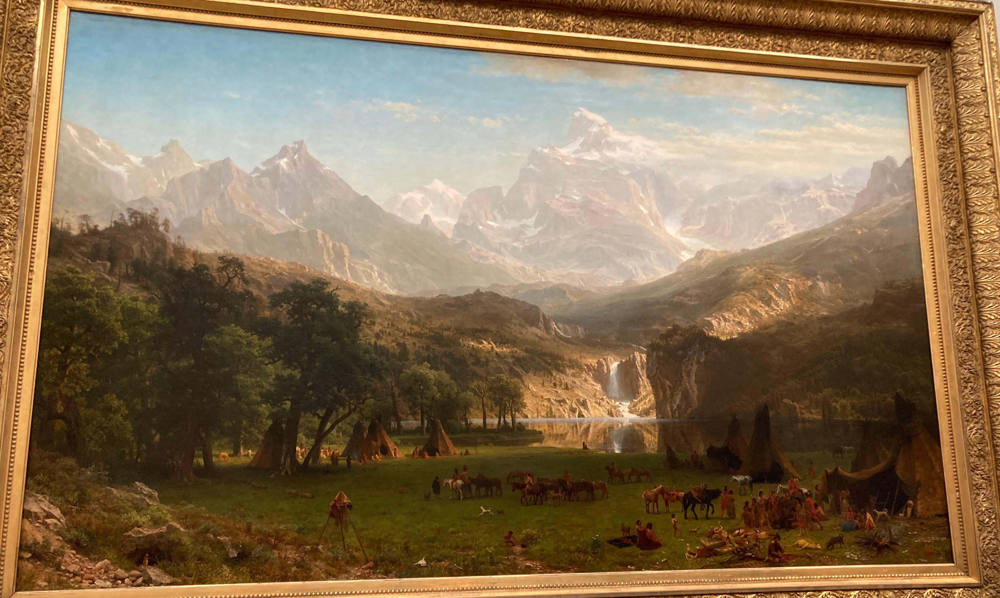
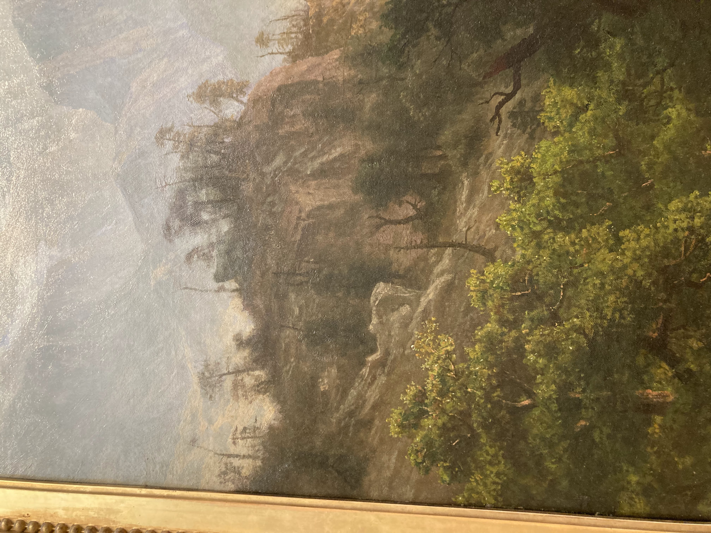
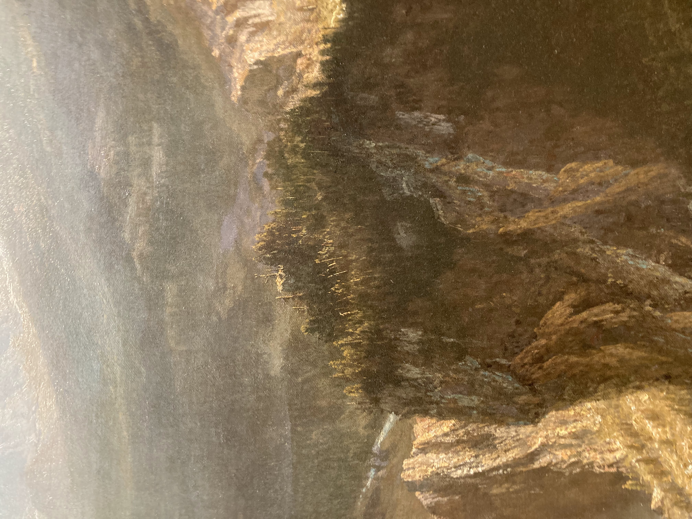

+++
title = "Rock Mountain Landscape Painting"
date = "2024-04-22"
description = "Landscape painting formal analysis."
+++

Albert Bierstadt, The Rocky Mountains, Lander's Peak, 1863. Oil on canvas. New York, The Metropolitan Museum of Art.

Bierstadt's painting depicts Lander's peak in modern day Wyoming. The painting can be divided into three regions, the flat plain at the bottom, the rocky forested terrain in the middle, and the large mountains in the distance.

## Flat plain
The bottom depicts the Shoshone Native Americans. Almost everyone is focused on what's in front of them, handling animals they hunted, weaving fabrics, chatting, or riding horses. The plain they are on is almost entirely flat. The individuals and their teepees are dwarfed by the trees beside them, and the huge mountains in the distance. They are also seperated from the rest of the landscape by the lake and the steep cliffs. The only two individuals looking up are those by the lake, admiring the waterfall and mountain.

Albert Bierstadt, The Rocky Mountains, Lander's Peak, 1863. Oil on canvas. New York, The Metropolitan Museum of Art.

There is also a cute little chipmunk in the bottom left. 

## Rocky middle terrain

Albert Bierstadt, The Rocky Mountains, Lander's Peak, 1863. Oil on canvas. New York, The Metropolitan Museum of Art.

The middle terrain emerges from sharp cliffs at the shore of the lake. At the top of the cliffs on the left and the right, many trees are lifeless and sharp. No animals are visible. There is also a powerful waterfall in the middle. The harshness of this terrain makes traversing through it appear impossible. 

Albert Bierstadt, The Rocky Mountains, Lander's Peak, 1863. Oil on canvas. New York, The Metropolitan Museum of Art.

Here, Bierstadt makes exceptional use of light. The waterfall towards the center is illuminated and naturally catches the eye. Illumination continues upwards and leads into the glacier which travels to the peak of the mountain. This naturally guides the eye towards the top of the mountain and makes it feel as though one should follow the illuminated path to summit the mountain.

## Large mountains
The large mountains occupy almost half of the image and dominate everything else, even the clouds beside them. While he uses an atmospheric perspective to show they are far away, the mountain do not lack detail. There are even more mountains poking out in the distance, making it seem like the mountains could go on forever.

## Details and message

Mention going to see the painting irl and the scale of it